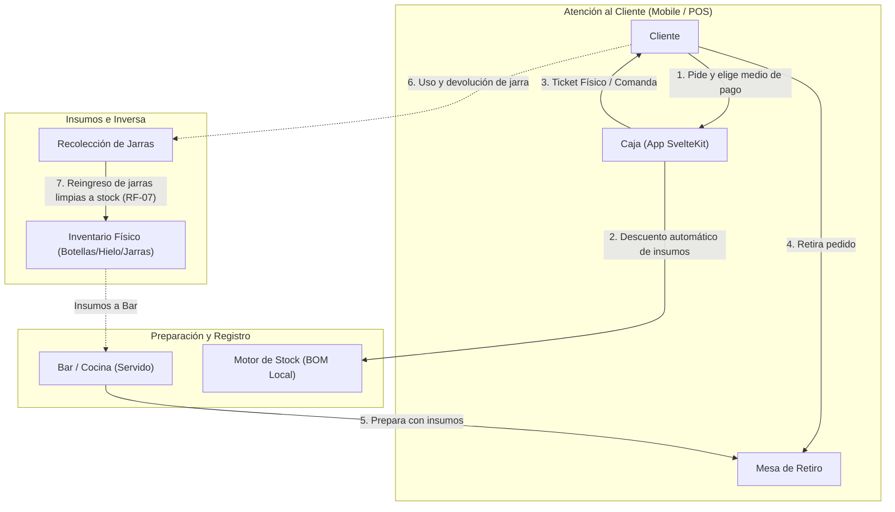

# Documento de Especificaciones Técnicas y de Sistema
## Sistema de Punto de Venta y Control de Inventario (Stand Scout)
### v2 — Ajustado a escala real y capacidad del equipo

---

## 1. Introducción y Objetivo

El presente documento especifica los requisitos y la arquitectura de software para un **Sistema de Punto de Venta (POS) y Control de Stock** diseñado para el stand de venta de bebidas de un grupo Scout en un evento de **200-300 personas**, con un flujo de caja de **hasta 10 personas en cola simultánea**.

El sistema es desarrollado por **un desarrollador junior, en un plazo de 5 días o menos**, en paralelo con otras obligaciones. Todas las decisiones de este documento priorizan **simplicidad de implementación** por sobre completitud teórica.

### Objetivos Clave:
* **Ágil registro de ventas en mobile:** Minimizar el tiempo de atención en Caja mediante una interfaz táctil ultra-rápida.
* **Descuento automático de insumos (Recetas/BOM):** Traducir unidades vendidas (ej. Jarras) a fracciones de insumos reales (Fernet, Coca-Cola, Hielo, Jarras físicas).
* **Visibilidad de stock informativa (no bloqueante):** Semáforo de stock que informa sin trabar la operación.
* **Post-procesamiento sobre tiempo real:** El análisis de ventas (horas pico, promedios, medios de pago) se hace **después** del evento, con calma. No es una feature en vivo.
* **Operación de Bajo Costo y Cero Infraestructura:** SvelteKit, LocalStorage, deploy gratuito, sin backend.

### Fuera de alcance (explícitamente, para no perder tiempo en 5 días):
* Sincronización automática en tiempo real entre múltiples dispositivos.
* Proyección de autonomía / agotamiento de stock en vivo (queda como curiosidad post-evento, no feature).
* Bloqueo duro de ventas por falta de stock.
* Identidad visual / diseño elaborado (se resolverá aparte, posiblemente con ayuda de un agente de diseño).
* Autenticación de usuarios y backend con datos compartidos en tiempo real (ver sección 8, "Fase 2 futura").

### Stack técnico y setup del proyecto

* **Lenguaje: TypeScript** (no JS plano). Dado el perfil del desarrollador (backend con Java/C++/Rust, afinidad por lenguajes tipados), TS reduce errores tontos en las entidades del dominio (`Insumo`, `Producto`, `Transaccion`) y compensa la menor experiencia relativa en frontend. Costo de setup: cero, el creador de proyectos lo integra con un check.
* **Framework: SvelteKit**, creado con `sv create` (o `npm create svelte@latest`, según la versión vigente al momento de arrancar).
* **Adapter: `@sveltejs/adapter-static`**, configurado como SPA con `fallback: 'index.html'` — necesario porque la app tiene rutas (`/`, `/stock`, `/cierre`, `/productos`) pero no hay servidor que las resuelva; el fallback permite que el router de SvelteKit tome el control del lado del cliente incluso si el cajero recarga la página en una ruta que no sea la raíz.
* **Estilos: Tailwind CSS**, elegido porque facilita que un tercero (agente de diseño u otra persona) rehaga la identidad visual más adelante sin tener que lidiar con CSS custom.
* **Linting: ESLint**, con el preset default del creador de proyectos — sin reglas custom, es una red de seguridad contra errores tontos (variables sin usar, imports rotos), no una herramienta a configurar en profundidad.
* **Explícitamente fuera del setup inicial** (no aportan al alcance de 5 días):
  * **Prettier:** opcional, a criterio personal. Sumarlo solo si ya es un hábito de formateo automático en el editor; no vale la pena como decisión de setup en sí misma.
  * **Testing (Vitest/Playwright):** no se usa. La lógica de negocio (`stock.ts`) se prueba manualmente llamando a las funciones desde la consola del navegador, según lo descrito en las historias de usuario.
  * **Storybook u otras herramientas de UI:** no se usan, sobran para el alcance actual.

**Checklist de creación del proyecto:**
- [ ] TypeScript: sí
- [ ] ESLint: sí
- [ ] Tailwind: sí
- [ ] Prettier: opcional (criterio personal)
- [ ] Testing (Vitest/Playwright): no
- [ ] Instalar y configurar `@sveltejs/adapter-static` con `fallback: 'index.html'`

---

## 2. Modelado Sistémico y Flujo de Información



---

## 3. Requisitos del Sistema

### 3.1 Requisitos Funcionales (RF)

* **RF-01: Gestión de Recetas / Bill of Materials (BOM)**
  * Definición de productos finales y su correspondencia en insumos.
  * Ejemplo: `1 Jarra Fernet` = `0.33 botellas Fernet` + `0.67 botellas Coca-Cola` + `1 Jarra` + `0.2 bolsa Hielo`.
  * Los insumos se dividen en dos tipos: **consumibles** (se dan de baja permanente al vender: Fernet, Coca-Cola, Hielo) y **retornables** (vuelven al stock: Jarras). Ver RF-07.

* **RF-02: Registro Ultrarrápido de Ventas (Caja Mobile)**
  * Flujo de 2 toques:
    1. Tocar botón grande del producto.
    2. Tocar medio de pago (Efectivo / Transferencia / Otro).
  * Al confirmar el medio de pago, se registra la transacción y se descuentan los insumos automáticamente.
  * Sin campos de texto ni formularios en el camino feliz.

* **RF-03: Semáforo de Stock (Informativo)**
  * 🟢 Verde: stock por encima del mínimo crítico.
  * 🟡 Amarillo: stock en o por debajo del mínimo crítico.
  * 🔴 Rojo: stock en 0.
  * El semáforo **nunca bloquea la venta**. En rojo, se muestra un modal de confirmación ("Sin stock de Fernet. ¿Confirmar venta igual?") pero la decisión final es del cajero.

* **RF-04: Ajuste Manual de Inventario**
  * Pantalla para registrar mermas (botellas rotas, derrames) y recuentos físicos.
  * Ajuste directo de `stockActual` para cualquier insumo, con motivo opcional en texto libre.

* **RF-05: Reporte Post-Evento (reemplaza la proyección en vivo)**
  * A partir del log de transacciones, generar (después del evento, no en vivo):
    * Ventas por hora (para identificar horas pico).
    * Total recaudado por medio de pago.
    * Producto más vendido / ranking de productos.
    * Consumo real de insumos vs. stock inicial.
  * No requiere gráficos en la app: alcanza con exportar el CSV de transacciones (RF-08) y procesarlo en una planilla (Excel/Google Sheets) con tablas dinámicas.

* **RF-06: Arqueo y Cierre de Caja**
  * Total recaudado por medio de pago.
  * Comparación de volumen teórico de insumos consumidos (según BOM) vs. conteo físico de botellas vacías/jarras, para detectar mermas no registradas.

* **RF-07: Reingreso de Insumos Retornables**
  * Los insumos `retornable: true` (jarras) no se dan de baja definitiva al vender: se mueven de `stockActual` a un contador `enUso`.
  * Botón "+1 jarra devuelta" en la UI de stock: resta de `enUso` y suma a `stockActual`.
  * Si `stockActual + enUso` cae por debajo del mínimo crítico, se alerta (posible pérdida/rotura de jarras).

* **RF-08: Exportar / Importar Datos (mecanismo simple de respaldo, "sync" y análisis externo)**
  * Botón "Exportar JSON" descarga un archivo con transacciones + estado de stock actual (backup completo).
  * Botón "Importar JSON" hace merge por `id` de transacción (evita duplicados).
  * Botón "Exportar CSV" descarga solo las transacciones en formato de planilla (columnas: `id`, `productoId`, `timestamp`, `medioPago`, `precio`), listas para abrir en Excel/Google Sheets y armar tablas dinámicas (RF-05).
  * Uso previsto: el JSON es para backup/merge entre dispositivos; el CSV es específicamente para el análisis post-evento en planilla.

* **RF-09: Gestión de Catálogo (Alta/Edición de Productos e Insumos)**
  * El catálogo de productos e insumos (RF-01) **no está hardcodeado**: es editable desde la app, sin tocar código ni redesplegar.
  * Permite: crear un producto nuevo (nombre, precio, receta de insumos y cantidades), editar precio o receta de uno existente, y desactivar uno que deje de venderse.
  * Permite lo mismo para insumos: crear uno nuevo, editar, desactivar.
  * Los productos/insumos desactivados no aparecen en la pantalla de Caja, pero las transacciones históricas que los referencian se conservan intactas.
  * Motivación: la carta de productos puede no estar cerrada al momento de desarrollar, y puede cambiar (precios, nuevas bebidas) hasta último momento antes del evento.

### 3.2 Requisitos No Funcionales (RNF)

* **RNF-01: Usabilidad Mobile-First.** Pantalla vertical, botones grandes, pensado para un celular en la mano del cajero.
* **RNF-02: Respuesta inmediata de UI.** Sin loaders ni esperas perceptibles al registrar una venta.
* **RNF-03: Resiliencia Offline vía LocalStorage.** Toda la operación funciona sin conexión; LocalStorage alcanza para el volumen de datos esperado (cientos de transacciones, no miles).
* **RNF-04: Despliegue Gratuito.** SvelteKit con `adapter-static`, deploy en Cloudflare Pages, Vercel o Netlify.
* **RNF-05: Separación de lógica y UI.** La lógica de negocio (BOM, cálculo de stock, registro de transacciones) vive en módulos independientes de los componentes Svelte, para poder testear y para poder rehacer la UI/diseño sin tocar la lógica.
* **RNF-06: Simplicidad por sobre patrones formales.** No se usan clases ni patrones Repository/UseCase con lógica encapsulada. La separación de responsabilidades se logra con archivos y funciones puras. Esto no excluye el uso de `interface`/`type` de TypeScript para tipar los datos (`Insumo`, `Producto`, `Transaccion`) — son solo definiciones de forma, no lógica ni comportamiento, y son consistentes con "simplicidad": ayudan a evitar errores, no agregan ceremonia.

---

## 4. Arquitectura de Software (Simplificada)

Se reemplaza la arquitectura de 4 capas por una de **3 módulos**, apta para un solo desarrollador junior en 5 días. La separación lógica/UI (RNF-05) se mantiene, pero sin la ceremonia de patrones formales.

```
src/
├── lib/
│   ├── data.ts              # BOM: catálogo de productos e insumos (constantes + funciones puras)
│   ├── stock.ts              # Lógica de negocio: registrarVenta(), reingresarJarra(),
│   │                         #   ajustarStock(), calcularSemaforo(), generarReporte()
│   ├── storage.ts            # Toda la persistencia: leer/escribir LocalStorage, exportar/importar JSON
│   └── components/
│       ├── BotonProducto.svelte
│       ├── SelectorMedioPago.svelte
│       ├── SemaforoStock.svelte
│       └── ModalConfirmacion.svelte
└── routes/
    ├── +layout.svelte
    ├── +page.svelte          # Caja (pantalla principal de venta)
    ├── stock/+page.svelte     # Ver stock, ajustar mermas, reingresar jarras
    └── cierre/+page.svelte    # Arqueo, exportar datos, reporte post-evento
```

**Regla de separación (RNF-05):** los archivos `.svelte` no calculan nada de negocio — solo llaman funciones de `stock.ts` y muestran el resultado. Esto es lo que te permite, más adelante, tirar toda la UI y rehacerla (por ejemplo con ayuda de un agente de diseño) sin tocar `data.ts`, `stock.ts` ni `storage.ts`.

---

## 5. Estrategia de Deploy y Funcionamiento Offline

* SvelteKit con `@sveltejs/adapter-static`, compilado a SPA.
* Deploy en Cloudflare Pages, Vercel o Netlify (gratuito, deploy automático desde GitHub).
* Sin Service Worker/PWA formal en esta versión — no es necesario para 5 días de desarrollo; LocalStorage y una pestaña abierta alcanzan para el volumen de este evento. Se puede agregar PWA más adelante si sobra tiempo.

---

## 6. Estructura de Datos

> **Nota sobre origen de los datos:** `data.ts` contiene únicamente un **catálogo semilla** (seed) usado la primera vez que se abre la app (LocalStorage vacío). A partir de ahí, el catálogo real vivo —el que usa la pantalla de Caja— se lee y escribe en LocalStorage, igual que el stock, y es editable vía RF-09 sin tocar código.

### Tipos TypeScript (definidos en `data.ts`)

```typescript
interface Insumo {
  id: string;
  nombre: string;
  unidad: 'botella' | 'unidad' | 'bolsa';
  retornable: boolean;
  stockActual: number;
  enUso?: number;           // solo aplica si retornable = true
  minimoCritico: number;
}

interface Ingrediente {
  insumoId: string;
  cantidad: number;
}

interface Producto {
  id: string;
  nombre: string;
  precio: number;
  ingredientes: Ingrediente[];
  activo: boolean;          // false = desactivado, no aparece en Caja (RF-09)
}

interface Transaccion {
  id: string;
  productoId: string;
  timestamp: string;        // ISO 8601
  medioPago: 'efectivo' | 'transferencia' | 'otro';
  precio: number;
  usuarioId: string | null; // null en esta versión, ver Fase 2 (sección 8)
}
```

Estos tipos son solo definiciones de forma (sin lógica) — ver RNF-06 sobre por qué esto es consistente con mantener la simplicidad del proyecto.

### Insumos (consumibles y retornables) — ejemplo de datos

```json
{
  "insumos": [
    { "id": "ins-1", "nombre": "Fernet 750ml", "unidad": "botella", "retornable": false, "stockActual": 20, "minimoCritico": 3 },
    { "id": "ins-2", "nombre": "Coca-Cola 2.25L", "unidad": "botella", "retornable": false, "stockActual": 40, "minimoCritico": 5 },
    { "id": "ins-3", "nombre": "Jarra Plástica 1L", "unidad": "unidad", "retornable": true, "stockActual": 85, "enUso": 15, "minimoCritico": 15 },
    { "id": "ins-4", "nombre": "Hielo 10kg", "unidad": "bolsa", "retornable": false, "stockActual": 10, "minimoCritico": 2 }
  ]
}
```

### Productos y recetas (BOM) — ejemplo de datos

```json
{
  "productos": [
    {
      "id": "prod-1",
      "nombre": "Jarra de Fernet",
      "precio": 5000,
      "activo": true,
      "ingredientes": [
        { "insumoId": "ins-1", "cantidad": 0.33 },
        { "insumoId": "ins-2", "cantidad": 0.67 },
        { "insumoId": "ins-3", "cantidad": 1.0 },
        { "insumoId": "ins-4", "cantidad": 0.2 }
      ]
    }
  ]
}
```

### Transacciones — ejemplo de datos

```json
{
  "id": "tx-001",
  "productoId": "prod-1",
  "timestamp": "2026-09-06T21:14:32Z",
  "medioPago": "efectivo",
  "precio": 5000,
  "usuarioId": null
}
```

> El campo `usuarioId` va en `null` por ahora (no hay usuarios en esta versión). Se incluye desde ya para que, si en una Fase 2 se agrega autenticación (ver sección 8), no haga falta migrar transacciones viejas — simplemente empiezan a tener un valor real.

---

## 7. Roadmap Sugerido (5 días)

1. **Día 1 — Datos y lógica pura:** `data.ts` con catálogo semilla, `stock.ts` con `registrarVenta()`, `ajustarStock()`, `reingresarJarra()`, `calcularSemaforo()`, y funciones de alta/edición de catálogo (RF-09). Probar todo desde la consola, sin UI.
2. **Día 2 — Persistencia, catálogo editable y pantalla de Caja:** `storage.ts` (LocalStorage) incluyendo el catálogo como datos editables; pantalla mínima para cargar/editar productos e insumos (RF-09); conectar `+page.svelte` con botones de producto + selector de medio de pago (RF-02).
3. **Día 3 — Stock y ajustes:** pantalla `stock/+page.svelte` con semáforo (RF-03), ajuste manual de mermas (RF-04), reingreso de jarras (RF-07).
4. **Día 4 — Cierre y exportación:** pantalla `cierre/+page.svelte`, exportar/importar JSON (RF-08), arqueo (RF-06).
5. **Día 5 — Pulido y buffer:** ajustes de UX básicos, pruebas con datos reales del evento, colchón para imprevistos. El reporte post-evento (RF-05) puede resolverse fuera de la app si el tiempo aprieta (exportar JSON y analizarlo en una spreadsheet).

> **Nota de prioridad:** aunque RF-09 (gestión de catálogo) esté numerado al final de la lista de requisitos, en la práctica es casi tan urgente como RF-01/RF-02: si la carta de productos todavía no está cerrada, la vas a necesitar antes de poder probar el flujo de venta con datos reales. Por eso aparece ya en el Día 1-2 del roadmap.

---

## 8. Fase 2 Futura (fuera de alcance de este sprint): Autenticación y Backend Compartido

Esta sección **no se implementa en esta versión**. Se documenta para dejar constancia de la intención y para que las decisiones de arquitectura actuales (sección 4) no la bloqueen sin querer.

### Por qué queda fuera de esta versión
Con 5 días de desarrollo, un solo dev junior y un evento de 200-300 personas con una sola caja, agregar autenticación y un backend con datos compartidos en tiempo real introduce problemas que no existen hoy (usuarios, sesiones, conflictos de escritura concurrente, elección y configuración de un proveedor de base de datos) sin resolver ningún problema real de este evento. El mecanismo de exportar/importar JSON (RF-08) ya cubre el único caso de "múltiples dispositivos" que puede darse a esta escala.

### Por qué la arquitectura actual no lo bloquea
* **`stock.ts` es agnóstico de dónde vive el estado.** Recibe un estado y devuelve un estado nuevo; no sabe si ese estado vino de LocalStorage o de un servidor. Esto no cambia en una Fase 2.
* **`storage.ts` es el único punto de contacto con la persistencia.** El día que exista un backend, este es el único archivo que se reemplaza o extiende — el resto de la app no se entera del cambio.
* **El campo `usuarioId` en las transacciones** (sección 6) ya está presente en `null`, evitando una migración de datos históricos si se agrega autenticación más adelante.

### Qué implicaría esta Fase 2 (a modo de referencia, no de compromiso)
* Elegir un proveedor de autenticación (por ejemplo, uno con capa gratuita) y definir roles (cajero, organizador).
* Elegir una base de datos compartida con capa gratuita (por ejemplo, alguna con soporte realtime) y migrar `storage.ts` para leer/escribir ahí en vez de LocalStorage.
* Definir una estrategia de conflictos de escritura (qué pasa si dos cajas venden el último insumo casi al mismo tiempo).
* Decidir si el modo offline-first se mantiene como respaldo (guardar local y sincronizar cuando vuelva la conexión) o se reemplaza por dependencia de conexión constante.

Esta fase se evaluaría después de correr el evento actual con la versión simple, que además va a dar información real sobre qué problemas vale la pena resolver.
